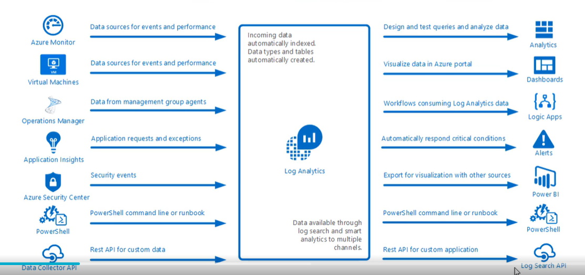
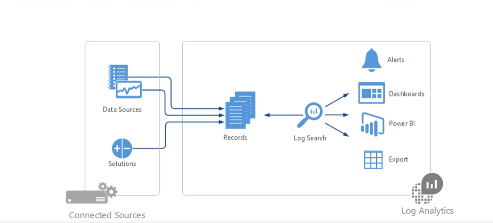

# Log Analytics

Key features
* Central Role in monitoring
* Data soruces
    * can plug-in many sources like VM, etc..
* Other Log Analytics Sources
    * can plug-in Security center, App Insights, etc..
* Search Queries
* Several Output Options

## Use Case

## Architecture

* Solutions can be third party (Marketplace available) 