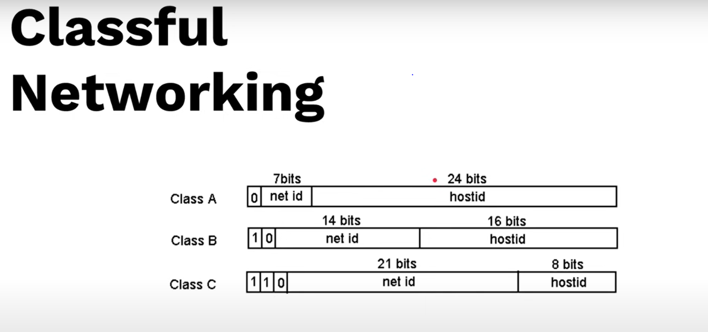
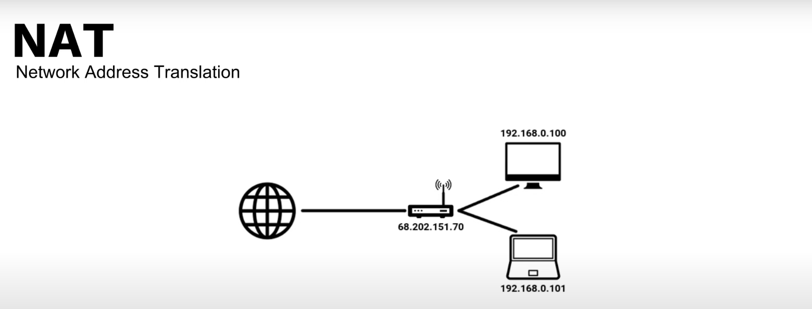
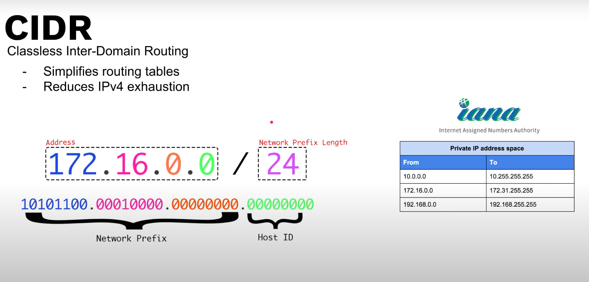

# Classful address 

Defines how net id and host ids are allocated

|Class	            |Leading bits   |	Network Bits|	HostID bits|	Address Range               | CIDR |
|--                 |--             |--             |--            |--                              |--    |
|Class A	        |0	            |8	            |24	           |0.0.0.0 to 127.255.255.255      |/8    |
|Class B	        |10	            |16	            |16	           |128.0.0.0 to 191.255.255.255    |/16   |
|Class C	        |110	        |24	            |8	           |192.0.0.0 to 223.255.255.255    |/24   |
|Class D (multicast)|1110	        |NA             |NA            |224.0.0.0 to	239.255.255.255 |NA    |	
|Class E (reserved) |1111	        |NA             |NA            |240.0.0.0	255.255.255.255     |NA    |

the network and host bits are fixed and no flexibility - resulted in too many wasted address

i.e. you will have smaller number of networks with too many hosts in them or too many networks with small number of hosts in them.

# Network Address Translation (NAT)

* connects private net to public network and takes care of address translations

NAT basically works by assigning different ports to different connections and tracking them

# Classless Inter-Domain Routing (CIDR)

CIDR solves address wastage issue by being flexible on network and host bits allocation

