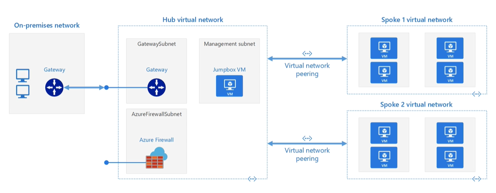

# VNET
A networking resource in Azure

* A VNET will have address range and one or more subnets
* Subnets will have its own address range that falls within the VNET range
* one subnet can be connected to antoher subnet
* VNETs are isolated 
    * 2 can have same address space as long as they were not connected to each other
    * when you connect two that have same or overlapping range then you will have problems 😞
* default OUT internet access
* IN internet access can be achieved using public ip

# DNS

* Azure provided
* custom

# Hub and Spoke model

