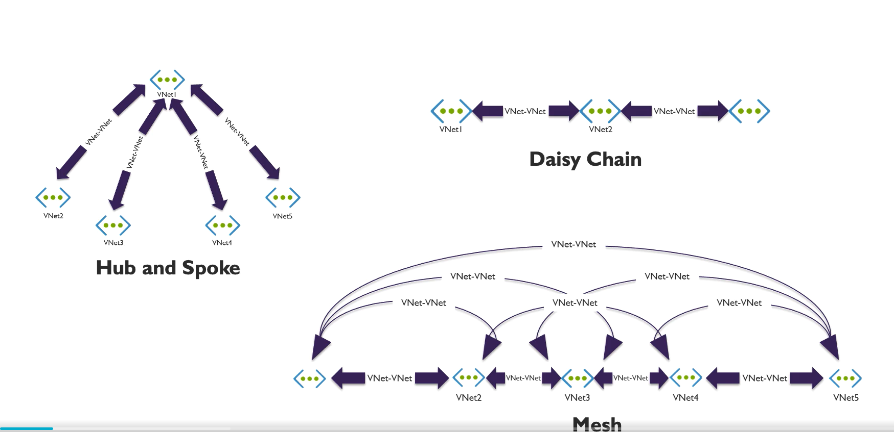
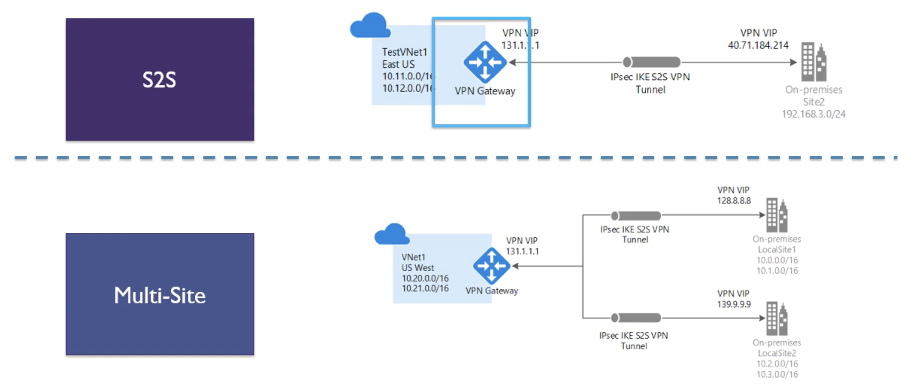
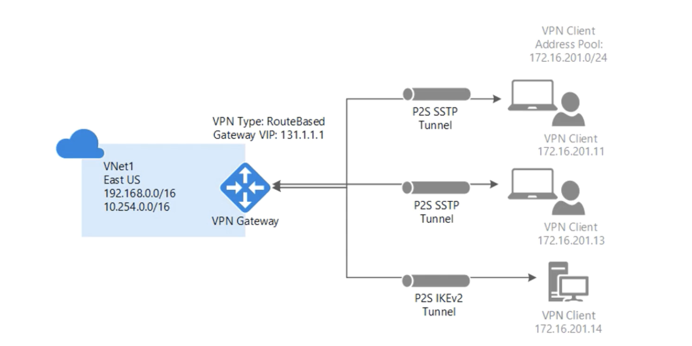

# General

Three main types of topologies

* Hub and Spoke
* Daisy Chain (possible via Gateway)
* Mesh

# VNET Peering

2 VNETs can be connected using VNET peering

* can be in same or different supported Azure region
* can be in diff subs
* bandwidth will be same if 2 VNETs are in same region as if they are part of same network 
    * i.e. no extra bandwith if 2 VNETs are part of same region
* across region uses Azure backbone
* global peering can exist in 
    * Azure public cloud region
    * China Cloud regions
    * Gov Cloud regions
* cannot peer across the regions
    * i.e. VNET in Public Cloud region cannot be peered with China Cloud region
* can use remote gateways or allow gateway transit
    * in globally peered VNETs
    * in locally peered VNETs
* no overlapping Address spaces
* can't add or delete address range after peering is created
    * soulution is to deleting the peer make adjustments and recreate peer (DOWNTIME 😞)
* can allow traffic to flow through gateway to remote VNET if the setting is enabled

[Ref](https://docs.microsoft.com/en-us/azure/architecture/reference-architectures/hybrid-networking/hub-spoke)

# Hybrid Connectivity

Generally used for on-perm to azure

* Site to Site (S2s)
* Express Route
* Point to Site (P2S)

## Site to Site

Simple option to connect two Hybrid VNETs

* can't have overlapping IPS
* S2S VPN gateway connection is a connection over *IPSec/IKE* (IKEv1 or v2) VPN tunnel
* on-prem should have VPN device with PIP
* can't be behind NAT
* can be used for cross-premises and hybrid

## Point to Site

Connecting clients directly to the network

* generally used in conjuction with Jumpbox

* secure
* no need for VPN device or PIP
* Windows 7, 8, 8.1, 10, 2008 R2, 2021, 2012 R2 64 bit are supported
* thourghput up to 100 Mbps (unpredictable due to internet)
* Doesn't scale, recommended only for few workstations