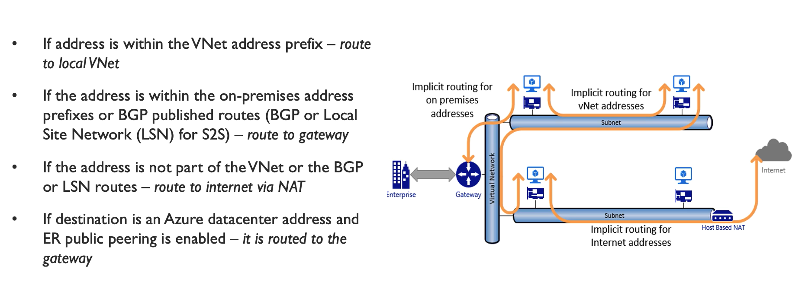
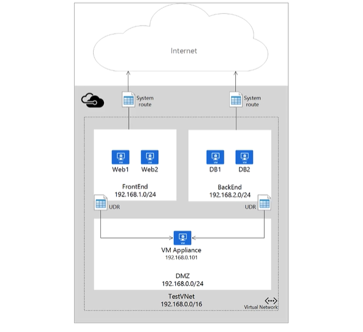

# Routing

defines how traffic reaches from one source to dest

Every subnet in Azure has the following *System Routes*

* Local VNET
    * no next-hop value
    * used for resources in the same VNET

* On-Premises
    * Route for defined on-prem address space
    * VNet Gateway is the next-hop address

* Internet
    * Route for all traffic destined to Internet
    * Internet Gateway is the next-hop

# User Defined Routing (UDR)

Overrides the default system routing

commonly used to
* force tunneling
* manage internet traffic on VMs

* once the UDR is created, add routes then it needs to be associated to Subnet
    * when adding routes you choose
        * address prefix (address space)
        * next-hop gateway

* can allow or disallow VNET gateway route propagation
    * useful when on-prem gateway exchanges BGP routes with Azure VNET gateway
        * one route entry added for each propagated routes
        * recommeded to summarise the routes to largest address space to reduce the entries