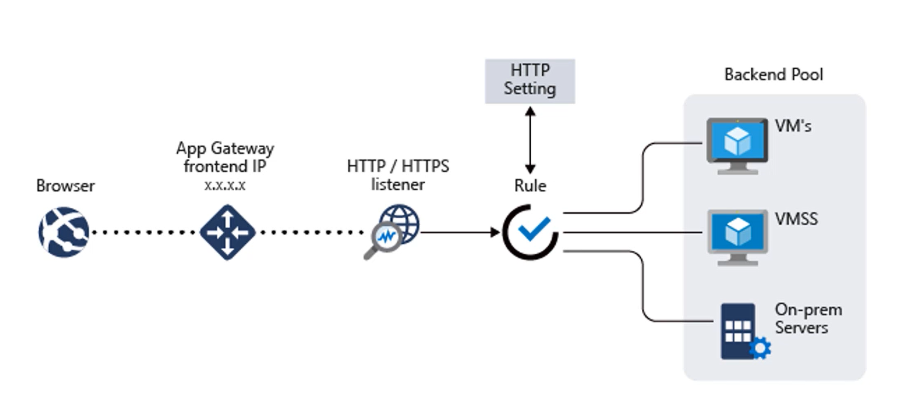
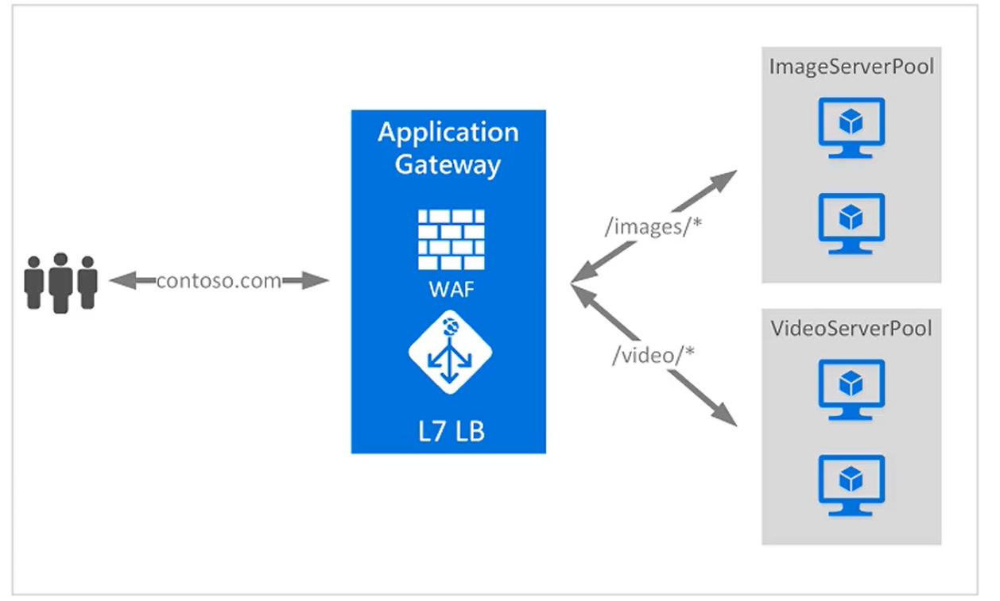

# Azure Load Balancer

* third party LB like F5 can be used

## Services

* Basic and Standard LB
    * Standard is preferred
    * small scale
    * public or private

* Application Gateway
    * specialised for web traffic
    * URL routing
    * webapp firewall ability

* Traffic Manager
    * Global traffic management
        * for globally distributed app ( more like DNS level traffic management)
        * separate traffic across regions

## Basic LB

* Layer 4 (Network layer)
* Supports upto 100 instances
* VMs in single Availability set or VMSS
* service monitoring
    * probe the health of instances behind the LB so traffic can be sent to diff node
* automated reconfiguring
    * when instances are added/removed LB takes care of balancing the traffic as needed
* hash-based distibution
    * uses 5 tuple hash, composed of
        * src port
        * src IP
        * dest port
        * dest IP
        * IP protocol number
* internal or public

## Standard LB

all from Basic and

* upto 1000 instances
* any VM in a single VNET
* supports Https
* availablity zone support
* secure by default

## App Gateway

* web app traffic manger
* layer 7 (application layer)
* routing decision can be made using app features like cookie for session affinity (thanks to layer 7) 
* SSL offload (redirecting)
* SKUs
    * Web app firewall sku provides more secure options (more cost)
* URL based content routing
* Requires its own subnet
* Highly Available
* depending on the sizes, the through puts are different
    * small
        * 7.5 Mbps for 6K page response
        * 35 Mbps for 100k page response
    * medium
        * 13 Mbps for 6K page response
        * 100 Mbps for 100k page response
    * large
        * 50 Mbps for 6K page response
        * 200 Mbps for 100k page response

