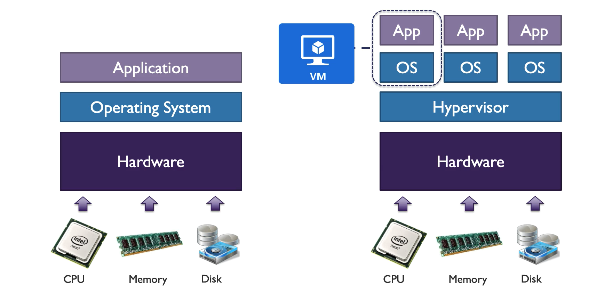

# Overview

* it is IaaS 
* not going to disapper anytime soon regardless of all PaaS and SaaS

Vmware - Vspear
Microsoft - Hypervisor

# VM Types

* A - Basic - for test and dev
* A - Standard - Gen purpose

* B - Burstable - burst to full capacity of the VM when needed (built credits and use that to burst)

* D - General Purpose (used most often) - for enterprice apps. DS offers premium storage

* DC - General Purpose secure - used for fraud detection, blockchain, AML, etc..

* E - Memory Optimised - high mem to cpu ratio. ES offers premium storage

* F - CPU optimised - high CPU core to mem ratio. FS offers Premium storage

* G - Godzilla - very large instance used for databases and big data use cases

* H - High Performance compute instances - for molecular modelling and scientific applications

* L - Storage optimised - higher disk throughput and IO

* M - Large Memory - Another large mem instance but it is huge one - upto 3.5 TB or RAM ( Microsoft is keep increasing it)o

* N - GPU enabled (NVIDA)

* SAP HANA on Azure Certified instance - purpose built and certified for running SAP HANA

[Reference](https://docs.microsoft.com/en-us/learn/modules/configure-virtual-machines/4-determine-virtual-machine-sizing)

# VM Specialisation

the VM series name can combine multiple codes too

for example 
* A2m_v2 - is a A series but configured with large memory
* H16mr - is H instance that supports Remote Direct Memory Access (R)