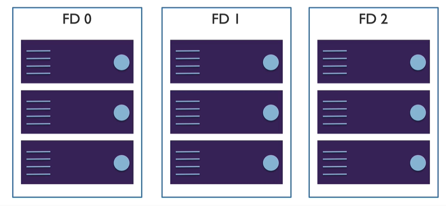

# Availablilty

how do ensure VM are up and running even during outages or planned maintenance?

potential for VM impact
* planned maintenance
* unplanned maintenance
* unexpected downtime (outage)

## Availablity Sets

* group two more more in a set
* separate based on 
    * fault domain
    * update domain

### fault domain

think of this as rack in MS datacenter, it has
* its own power
* network
* hypervisor hosts

