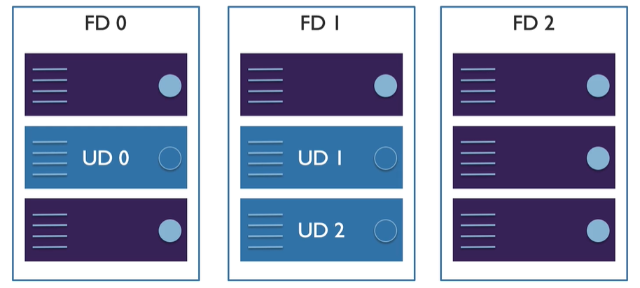

# Availablilty

how do ensure VM are up and running even during outages or planned maintenance?

potential for VM impact
* planned maintenance
* unplanned maintenance
* unexpected downtime (outage)

## Availablity Sets

* group two more more in a set
* separate based on 
    * fault domain
    * update domain

### fault domain (FD)

think of this as rack in MS datacenter, it has
* its own power
* network
* hypervisor hosts

if we put 3 machines in an availability set in region that support availability set of 3 nodes
* then each of those will be deployed on independant FDs
* if we put 6 then each FD will have 2 machines

### update domain (UD)

think of this as individual physical machine in the rack

* patching windows, etc...

### planning

rather than creating an availability set for all tiers of an app (web, app, db), create one for each tier

* web tier avaialblity set
* app tier
* db tier

## Availabilty Zones

Unique physical location within an Azure region connected with high speed network

* offers 99.99% VM uptime SLA
* combination of fault domain and update domain by default
* zonal services - VM pinned to a particular zone
* zone redundant services - PaaS like database, etc..

> Not available in all the regions - if not available use Availablity Set