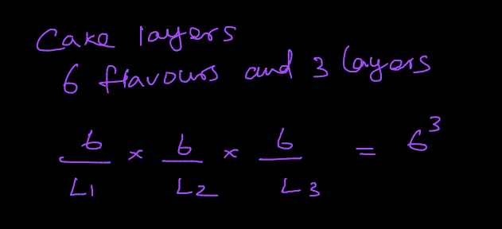
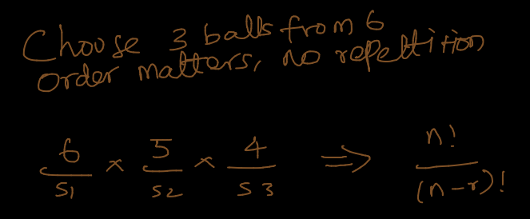

# Combinatorics

* permutation interested in order
* combination not interested in order
* memory trick
  * people usually say combinations to the lock but they actually mean permutation because order matters in lock combinations
* repetition means item is available for selection even if it was selected before (this is sometimes referred to as with replacement)

**🟢 IMPORTANT 🟢** always reason with the problem using **slots** example for intuition

## Permutation

* example

$$
\{A,B\} = \{AB,BA\}
$$

### Permutation With Repetition [Cake Layer]

* permutation of `n` when selecting `r` items with repetition is
* think like choosing 3 layers for cake from total of 6 (order matters)

$$
nPr = n^r
$$

**🟢 INTUITION 🟢** - how many ways you can place 6 favours in 3 slots

### Permutation Without Repetition [Choosing ball, order matters]

* permutation of `n` when selecting `r` items without repetition is
* think like how many ways we can choose 3 balls from pool of 12 (order of the ball matters)

$$
nPr = \frac{n!}{(n-r)!}
$$

or

$$
P(n,r) = \frac{n!}{(n-r)!}
$$

* we read this as `permutation of n when choosing r`

* permutation of `n` when selecting all items without repetition is $n!$

$$
nPn = n!
$$

**🟢 INTUITION 🟢** - how many ways you can place 6 balls in 3 slots

## Combination

### Combination with Repetition [Icecream flavours]

* combination of `n` when selecting `r` items with repetition is
* think of choosing 3 icecream flavours from total of 6, you can choose same twice or thrice as well

$$
nCr = \frac{(n + r - 1)!}{(n-1)!r!}
$$

### Combination Without Repetition [Choose Balls]

* combination of `n` when selecting `r` items without repetition is
* think like how many ways we can choose 3 balls from pool of 12 (order of the ball doesn't matter)

$$
nCr = \frac{n!}{(n-r)!r!}
$$

**🟢 INTUITION 🟢** - how many ways you can place 6 balls in 3 slots

### Example

Suppose 4 students out of 12 need to picked for a sports competition. John and Jane are siblings and they want to play together. We need to find the probability of picking them together for the competition

Total possible outcome $\implies$ combination of picking 4 students from 12 is

$$
C(12, 4) = \frac{12!}{(12-4)!4!} = 495
$$

Desired outcome $\implies$ John and Jane takes two places so we left with 2 more places. So we need to find combination of picking 2 from 10

$$
C(10, 2) = \frac{10!}{(10-2)!2!} = 45
$$

so,

$$
    P = \frac{45}{495} = 0.091
$$

the probability of John and Jane ending up in the same team is 9.1%

### References

1. <https://www.youtube.com/watch?v=XJnIdRXUi7A>
2. <https://www.mathsisfun.com/combinatorics/combinations-permutations.html>
