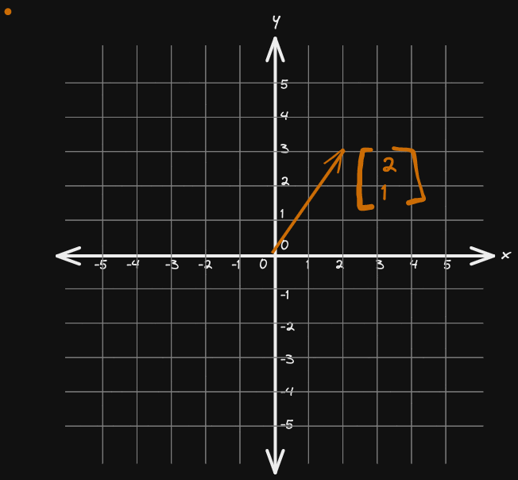

# What is Vector?

* Vector is an array of numbers with fixed orders.

* Row Vector $\begin{bmatrix} 1 & 2 & 3 & 4 \end{bmatrix}$ 

* Column Vector $\begin{bmatrix} 1 \\2 \\3 \\4 \end{bmatrix}$

* Geometrically, vector is something with a length (magnitude) and direction. The following is 2d vector in cartesian plane.

All the properties of lower dimension (1D, 2D and 3D) vector applies to higher dimensions (above 3D) as well.

# System of Linear Equations

3a + b = 8

a - 2b = 5

Set of equations relating one or more (equal) number of unknowns.

We call them `system` because it is collection of interrelated parts work together number of unknowns.

and it is linear because if we plot each of the equations it will be a line 

This can be written as matrix and vector multiplication

$$\begin{bmatrix} 3 & 1 \\
1 & -2 \end{bmatrix} \begin{bmatrix} a \\
b \end{bmatrix} = \begin{bmatrix} 8 \\
5 \end{bmatrix}
$$

**coefficient matrix `x` unknown vector = result vector**

$A\vec{x} = \vec{b}$