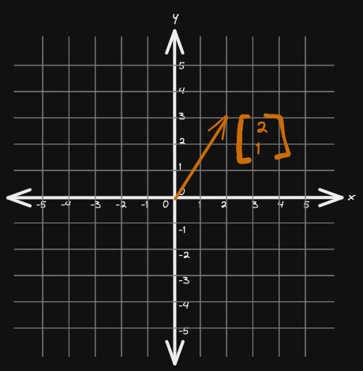
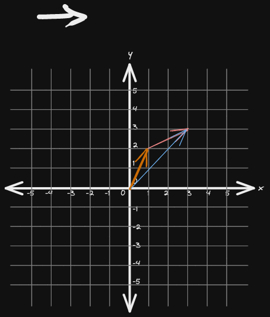

# What is Vector?

 Vector is an array of numbers with fixed order.

* Row Vector

$$\begin{bmatrix}1 & 2 & 3 & 4 \end{bmatrix}$$

* Column Vector

$$\begin{bmatrix} 1 \\
2 \\
3 \\
4 \end{bmatrix}$$

Geometrically, vector is something with a length (magnitude) and direction. The following is 2d vector in cartesian plane.

* Each item in the vector is called element or component

* Column vector is common

* All the properties of lower dimension (1D, 2D and 3D) vector applies to higher dimension vectors (above 3D) as well

## Vector Operations

1. Scalar Multiplication
2. Vector Addition

### 1. Scaler Multiplication

Scaler multiplication means multiplying each element of a vector by the scaler.

In other words, scaling each element by a scale factor.

$$
2 \begin{bmatrix} 1 \\
2 \end{bmatrix} = \begin{bmatrix} 2 \\
4 \end{bmatrix}
$$

Geometrically, the vector is scaled or squished by the scale factor

* scaler multiplication leaves the direction (angle) but scales the magnitude

🔴 IMPORTANT 🔴 **scaling will not change the direction of the vector but it can change orientation, for example when scaling by -1, the orientation is flipped**

### 2. Vector Addition

Vector addition means adding corresponding components of two vectors.

Vectors must have same dimensions to add.

$$
\begin{bmatrix} 1 \\
2 \end{bmatrix} +\begin{bmatrix} 2 \\
1 \end{bmatrix} = \begin{bmatrix} 3 \\
3 \end{bmatrix}
$$

Geometrically, it means moving tail of a vector to tip of another vector. A new vector from origin to new tip is the result vector.

Subtracting two vector means negating (multiplying by scaler -1) each element in the second vector then adding each corresponding elements

$$
\begin{bmatrix} 1 \\
2 \end{bmatrix} + (-1)\begin{bmatrix} 2 \\
1 \end{bmatrix} = \begin{bmatrix} -1 \\
1 \end{bmatrix}
$$

Another approach to look at subtraction is a vector connecting tip of one vector to another but tail moved to the origin.

$$ (\vec{a} - \vec{b}) + \vec{b} = \vec{a} $$

This means there exist a vector such that if we add it to $\vec{b}$ we get $\vec{a}$

## Linear combination

🔴 IMPORTANT 🔴 **Scaling and adding two or more vectors is called Linear Combination of those vectors**

## Linear transformation

We can say the transformation is linear if the result of applying the transformation then scaling it is equal to scaling it first then applying the transformation.

🏀 EXAMPLE 🏀 You buy 2 cakes and 1 coffee in a cafe in Europe. You want to pay in Pound. Consider the conversion as transformation. The transformation is linear when the result is same regardless of if you first find the total in EUR and convert it to GBP or convert each item cost to GBP then find the total.

Geometrically, when the transformation is applied the space will be changed evenly and their won't be any curves.

## System of Linear Equations

3a + b = 8

a - 2b = 5

Set of equations relating one or more (equal) number of unknowns.

We call them `system` because it is collection of interrelated parts work together number of unknowns.

and it is linear because if we plot each of the equations it will be a line

This can be written as matrix and vector multiplication

$$\begin{bmatrix} 3 & 1 \\
1 & -2 \end{bmatrix} \begin{bmatrix} a \\
b \end{bmatrix} = \begin{bmatrix} 8 \\
5 \end{bmatrix}
$$

**coefficient matrix `x` unknown vector = result vector**

$A\vec{x} = \vec{b}$

## Unit Vector

Unit vector is a vector with magnitude 1.

We can get unit vector of any vector by dividing it by its magnitude.

$$ \hat{a} = frac{\vec{a}}{b} $$