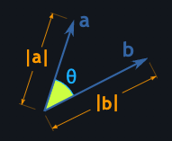

# Dot Product

## What is it?

Dot product of two vector is sum of products of corresponding elements in the vector.

$$ \vec{a} . \vec{b} = \sum_{i = 0}^n a_ib_i $$

## Example

$$\begin{bmatrix} 4 \\
5 \end{bmatrix} . \begin{bmatrix} 6 \\
7 \end{bmatrix} = 4 \times 6 + 5 \times 7 = 59
$$

## Alternate calculation method (or from polar coordinates)

If we know the angle between two vectors, then we can calculate the dot product using cosine rule.

$$ \vec{a}.\vec{b} = \Vert{a}\Vert \times \Vert{b}\Vert \times cos({\theta})$$

With polar coordinate we get magnitude and angle for each vector. For example 
$$\vec{a} = (5, 30\degree)$$
and 
$$\vec{b} = (8, 45\degree)$$

Now, $\vec{a}.\vec{b} = \frac{5 \times 8} $

## Requirements

* vectors must be of same dimensions.

## Properties

* dot product result is scalar
* commutative $\vec{a}.\vec{b} = \vec{b} . \vec{a}$
* distributive over addition $\vec{a}.(\vec{b} + \vec{c}) = \vec{a}.\vec{b} + \vec{a}.\vec{c}$

## Useful to know

### 1. Scalar projection

Geometrically, dot product of two vectors is projection of one vector over the other then multiplying the magnitude of those vectors

## Inner product

Inner product is more general form for dot product, the result of inner product may span to complex number space $C$.

In other words, dot product is a special form of inner product which is limited to real number space $R$.

<!-- * more details on vector projection below

$$ \begin{bmatrix} a & b \\
c & d \\ 
\end{bmatrix} \space .  \begin{bmatrix} e & f \\
g & h \\
\end{bmatrix} = (a \times e) + (b \times f) + (c \times g) + (d \times h) $$ -->

## References

1. <https://www.mathsisfun.com/definitions/projection.html>
2. <https://www.mathsisfun.com/algebra/vectors-dot-product.html>
