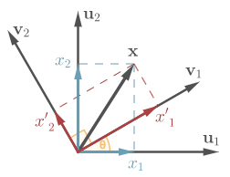

# Change of basis (vector)

## Span

A vector can be seen as linear combination of basis vectors of that vector space.

All the points that can be reached by linear combination of vectors is called `span` or `vector space` of those vectors.

2 orthogonal basis vectors of 2D coordinate system can cover the entire plane. So the `span` of such vectors is the entire plane. For 3D coordinate system, it will be 3D space. 

## Change of basis

The standard basis vector we use is the unit vector in the direction of each dimension of the coordinate system.

For example, 2D coordinate basis vectors are

$$
\begin{bmatrix}1 \\ 
0\end{bmatrix} and \begin{bmatrix}0\\
1\end{bmatrix}
$$

Any vector can be written as linear combination of these two basis vector.

$$
\begin{bmatrix}3 \\ 
2\end{bmatrix} = 3\times \begin{bmatrix}1\\
0\end{bmatrix} + 2\times \begin{bmatrix}0\\
1\end{bmatrix}
$$

Sometimes we will have different basis vector than a standard one. So, we need a way to convert a vector to and from one vector space to antother.

To convert a vector $\vec{x}$ from vector space of $\vec{u_1} \space and \space \vec{u_2}$ to vector space of $\vec{v_1} \space and \space \vec{v_2}$, perform the following

1. 

## References

1. <http://www.boris-belousov.net/2016/05/31/change-of-basis/>

