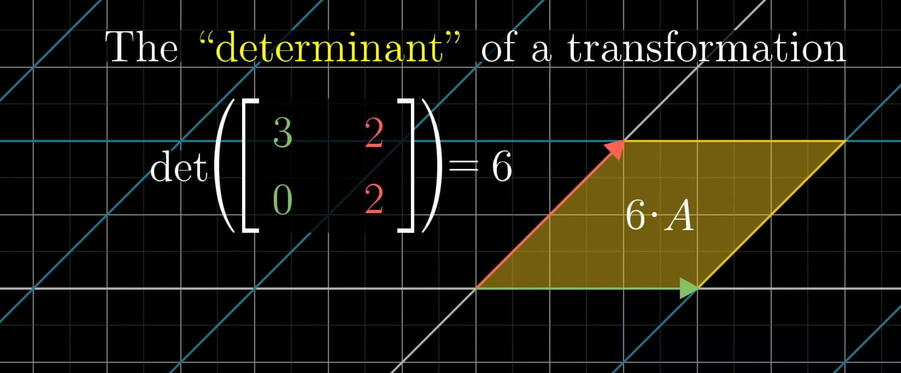

# Determinants

Lets take a matrix

$$
\begin{bmatrix}
a & b \\
c & d
\end{bmatrix}
$$

when we plot this (as row vector) and close the loop, it will look like this

Determinant is the area of the parallelogram (for 3D it is volume)

which is `ad - bc` 

> **memory trick: think that you are writing the strokes of X**

* determinant can be found only for square matrix
* it helps to see if can find inverse of a matrix

When we think of matrix as linear transformation, the determinant is the factor by which the linear transformation changes any area. 

# Reference
1. [More info](https://www.mathsisfun.com/algebra/matrix-determinant.html)