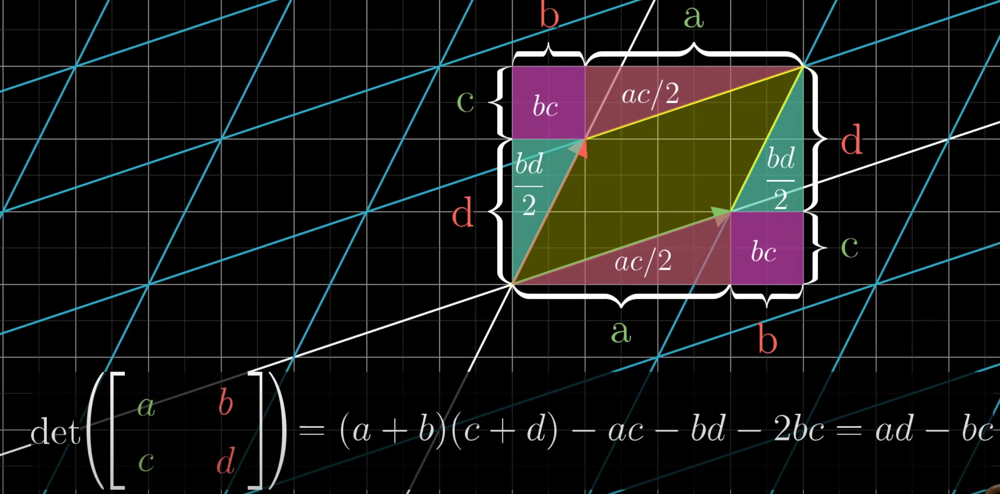

# Determinants

Determinant of a square matrix is a scaler value indicating the factor by which the area is scaled.

Negative value indicates the orientation is flipped.

Zero determinant means

* the the transformation squishes vector into a lower dimension
* there is no inverse matrix

Lets take a matrix

$$
\begin{bmatrix}
a & b \\
c & d
\end{bmatrix}
$$

when we plot this (as row vector) and close the loop, it will look like this

* Determinant is factor by which the area has changed by the linear transformation.

* In this example, the area of the parallelogram (for 3D it is volume)

which is `ad - bc`

> **memory trick: think that you are writing the strokes of X**

* determinant can be found only for square matrix
* it helps to see if inverse of a matrix exist

* When we think of matrix as linear transformation, the determinant is the factor by which the linear transformation changes any area

* If a determinant of a matrix is zero then it means, the transformation pushes everything into a smaller dimension (for 2D it could be a line or a point).

🔴**IMPORTANT**🔴 **If determinant of a matrix is zero then there is no inverse, i.e. we cannot reverse the result of the transformation.**

* if the determinant is negative then it means the orientation is changed by the transformation.

# Reference
1. [More info](https://www.mathsisfun.com/algebra/matrix-determinant.html)