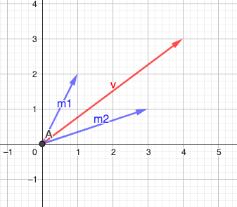

# Change of basis (for non orthogonal basis)

If the target basis vectors are orthogonal, we can change the basis of the vector by projecting the vector on to the target basis vectors and  create a new vector from the projection's linear combinations.

This is computationally inexpensive and preferred if the basis vectors are orthogonal.

But if the target basis vectors are not orthogonal then we have to use matrix for the transformation.

## Example

Lets say we use the following (orthonormal) basis vectors in the **`Earth`** forming matrix $E$

$$
\begin{bmatrix}1 \\
0\end{bmatrix} \space and \space \begin{bmatrix}0 \\ 
1\end{bmatrix}
$$

$$
E = \begin{bmatrix}1 & 0\\
0 & 1\end{bmatrix}
$$

and the following basis vector in **`Mars`** written in our Earth's coordinate system forming matrix $M_e$

$$
m_1 = \begin{bmatrix}1 \\ 
2\end{bmatrix} \space and \space m_2 = \begin{bmatrix}3 \\
1\end{bmatrix}
$$

$$
M_e = \begin{bmatrix}1 & 3\\
2 & 1\end{bmatrix}
$$

Mars basis vector is not orthonormal and not even orthogonal but linearly independent.

Now, lets say we have vector $\vec{v_m}$ (written) in Mars coordinate system

$$
\vec{v_m} = \begin{bmatrix}1 \\
1\end{bmatrix}
$$

Now to convert this to Earth's coordinate system, we need to left multiply the vector $\vec{v_m}$ by matrix of Mars basis vectors written in Earth's coordinate system

$$
\vec{v_e} = M_e \vec{v_m} 
$$

$$
\vec{v_e} = \begin{bmatrix}1 & 3\\
2 & 1\end{bmatrix}\begin{bmatrix}1 \\
1\end{bmatrix} = \begin{bmatrix}4 \\
3\end{bmatrix}
$$

To reverse this we just need to multiply the result vector with $M_e^{-1}$

$$
\vec{v_m} = M_e^{-1} \vec{v_e} 
$$

$$
\vec{v_e} = (-\frac{1}{5}) \begin{bmatrix}1 & -3\\
-2 & 1\end{bmatrix}\begin{bmatrix}4 \\
3\end{bmatrix} = \begin{bmatrix}1 \\
1\end{bmatrix}
$$

## Motivation

The main reason for changing basis is it is much easier to perform transformations on vectors with orthonormal basis.

So lets say we want to Shear a vector in Mars coordinate system

1. We first convert $\vec{v_m}$ to $\vec{v_e}$
2. Apply transformation on $\vec{v_e}$
3. Then convert the result back to Mars coordinate system

## Gram Schmidt Process

Given we have vector space with non orthogonal basis vectors then the process by which finding orthonormal basis vectors for the same vector space is called `Gram Schmidt Process`.

* This is very useful process as it is much easier to work with orthonormal basis vectors than non orthonormal basis.

* If input vectors are already orthonormal then we will just find another set of orthonormal basis vectors.