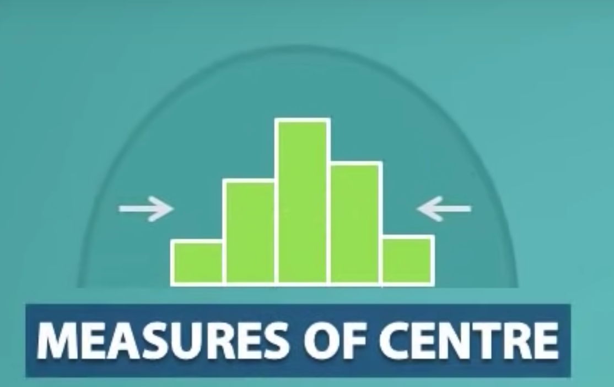

# Basics

## What is Statistics?

Collection and interpretation of data

* used to measure and analyse `variability`
  * for example age height, weight and hair color of people in the world
  * what we measure from each individual is variable of interest

### Types of statistics

* Descriptive
* Inferential

#### Descriptive statistics

* means getting data and talking about it
  * example: average rainfall in London
* often explained with charts such as histogram, time plot, etc..

#### Inferential statistics

* deals with taking and analysing a sample to make judgements or claims about a population

## Common Terminologies

* Population
  * Refers to the total amount of `things`
    * `things` could be anything like cat, virus type, age, planets, etc..

* Sample
  * Small part of the population that is used for study

* Sample Size
  * Total amount of `things` in the sample

* Variable
  * What we are studying is variable
    * example: age, height, hair color, etc..
  * they are
    * countable
    * measurable
    * categorised
  * two types
    * quantitative
      * two types
        * discrete
          * values that can only be measured in certain numbers
            * example: number of pets you own 
        * continues
          * can take any numerical values (real number) 
            * example: weight
    * categorical
      * two types
        * categorical ordinal
          * has logical ordering to values (i.e. makes sense to order)
            * example: grade
        * categorical nominal
          * no logical ordering (i.e. doesn't make sense to order)
            * example: hair colour
  * explanatory vs. response
    * explanatory
      * explains the outcome of the study
    * response
      * measures the outcome of the study
    * example
      * age vs. height of the tree
        * age - explanatory

* Quantitative Data
  * comes from quantitative variables
    * example: age, height, etc...
  * data that is measured in numbers
  * should make sense to perform arithmetic calculations with
    * example: average, sum, etc...

* Categorical data
  * comes from categorical variable
    * example: hair colour, type of cat, etc...
  * refers to values that place `things` into different groups or categories

## Describing Distribution using numbers

* Mode
* Median
* Mean
* Range
* Standard Deviation
* Variance

These give numerical information on the distribution of data

* Mode, Median and Mean are measures of center or central tendency

* Range and Standard Deviation are measures of spread

### Mode

* refers to data values that is most frequently observed

### Median

* refers to data value that is positioned in the middle of an **ordered** data set

* formula

$$
    median = \frac{n+1}{2}
$$

* when `n` is even number than we will get a number that is between two positions
  * median is average of data values from those two positions

### Mean

* another name for arithmetic average
* formula

$$
\bar{x} = \frac{\sum{x_i}}{n}
$$

If mean comes from sample we use $\bar{x}$ otherwise $\mu$ is used

### Median vs. Mean

* Median refers to physical middle point
* Mean refers to balance point (like in seasaw)

### Range

* expresses how much room the distribution takes

$$
range = max - min
$$

### Standard Deviation

* how close the values are in the dataset to the mean
  * small value means the values are very close to mean
    * distribution is less spread out
  * high value indicates high amount of variability in a given dataset 
    * lot more values further from the mean
    * distribution is more spread out
* formula

$$
s = \sqrt{\frac{\sum{(x_i - \bar{x})^2}}{n-1}}
$$

$s$ is used for standard deviation of sample and $\sigma$ is used for the standard deviation of population

### Variance

* closely related to standard deviation

* formula

$$
s^2 = \frac{\sum{(x_i - \bar{x})^2}}{n-1}
$$

### Effects of transforming data on Spread and Center

* **measures of center** affected by performing the following operations to each of the values in the dataset
  * addition
  * subtraction
  * multiplication
  * division

* **measures of spread** only affected by
  * multiplication
  * division

## Five Number Summary

Divides the data into 5 equal quarters

Boxplot can be used to provide visual representation of 5 number summary

* Minimum
  * smallest value in a dataset
* 1st Quartile (Q1)
  * median of the first half
  * 25% of the data is below it
  * 75% of the data is above it
  * essentially median of the median
  
* Median (Q2)
  * middle data value
  * 50% of the data is below it
  * 50% of the data is above it

* 3rd Quartile (Q3)
  * median of the second half
  * 75% of the data is below it
  * 25% of the data is above it
  
* Maximum
  * largest value in the data set

### Interquartile range (IQR)

* value between Q1 and Q3 is IQR
* represents range of middle 50% of the data

$$
IQR = Q3 - Q1
$$

## Percentile

* describes the percentage of data that fall at or below a another data value in an ordered dataset
* example:
  * 50th percentile means
    * 50% of the data are as small or smaller
    * 50% of the data are as large or larger
    * this is also median
    * repeated values can occur

  
  * 75th percentile means
    * 75% of the data are as small or smaller
    * 25% of data are as large or larger
    * this is also 3rd Quartile (Q3)