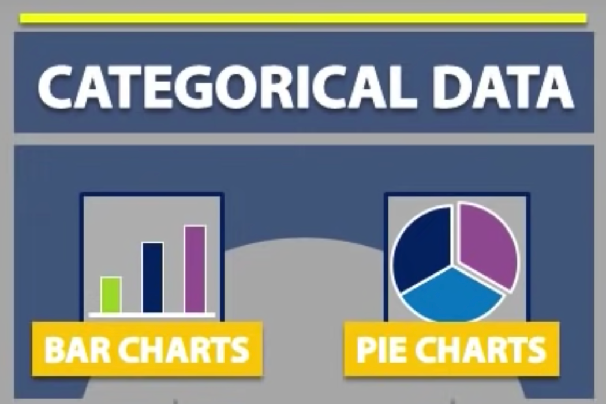

# Charts and Plots

Charts and Plots are used as tools to display data.

* Bar Chart (categorical)
* Pie Chart (categorical)
* Histogram (quantitative)
* Stemplots (quantitative)
* Timeplots (quantitative)

