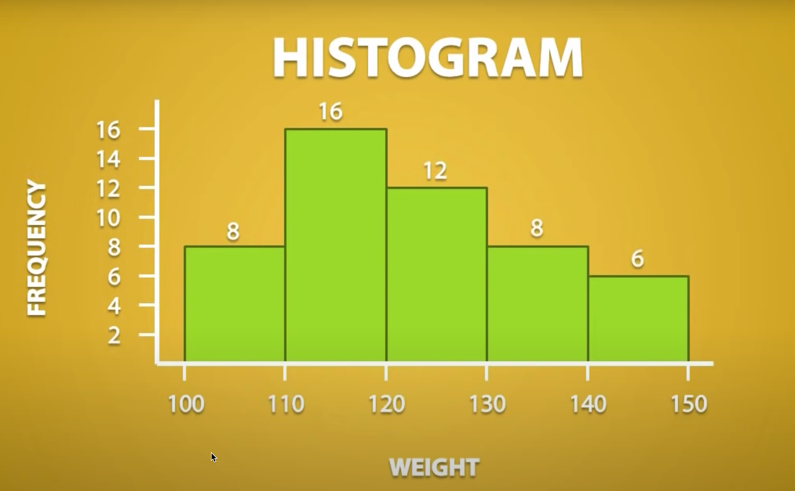
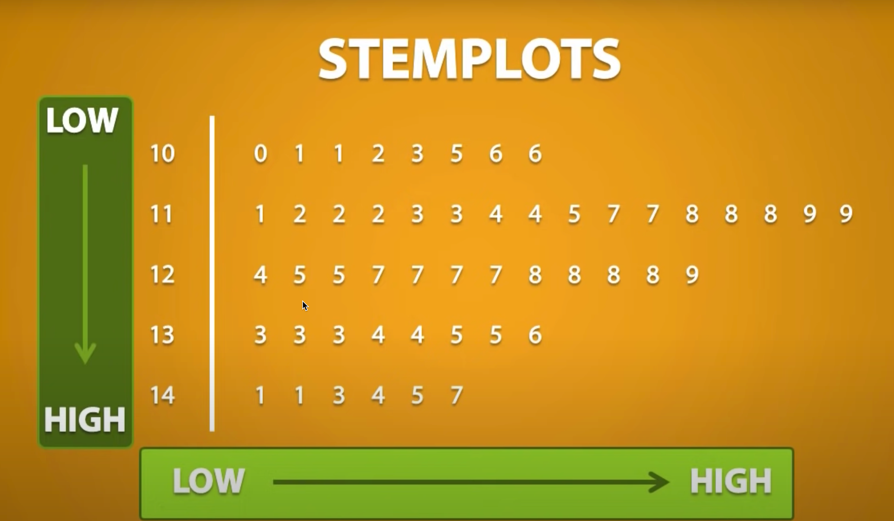
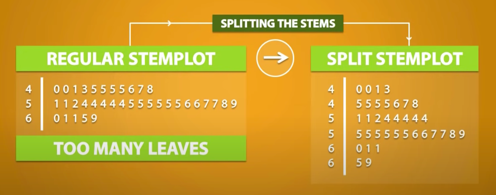
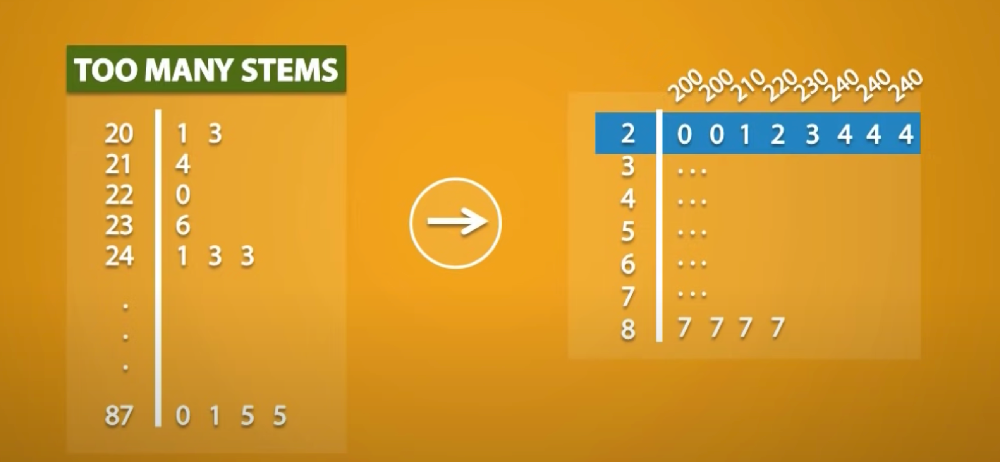
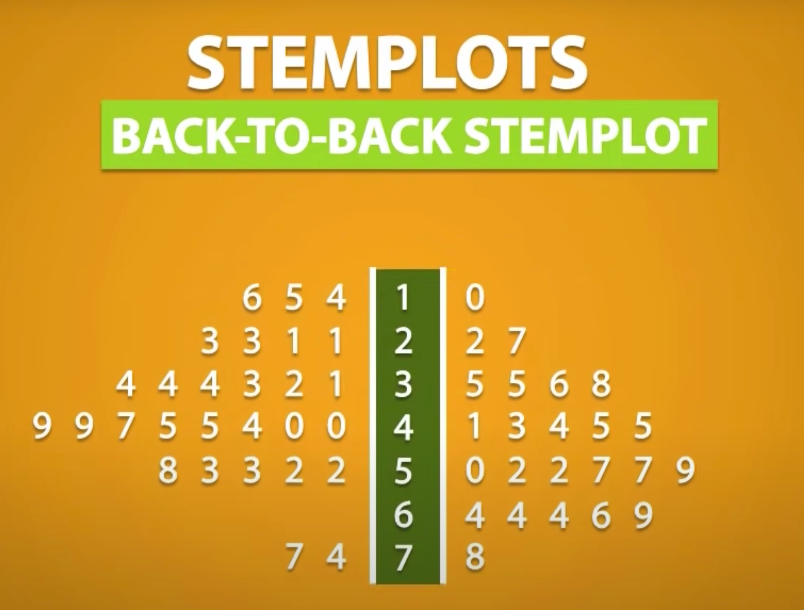
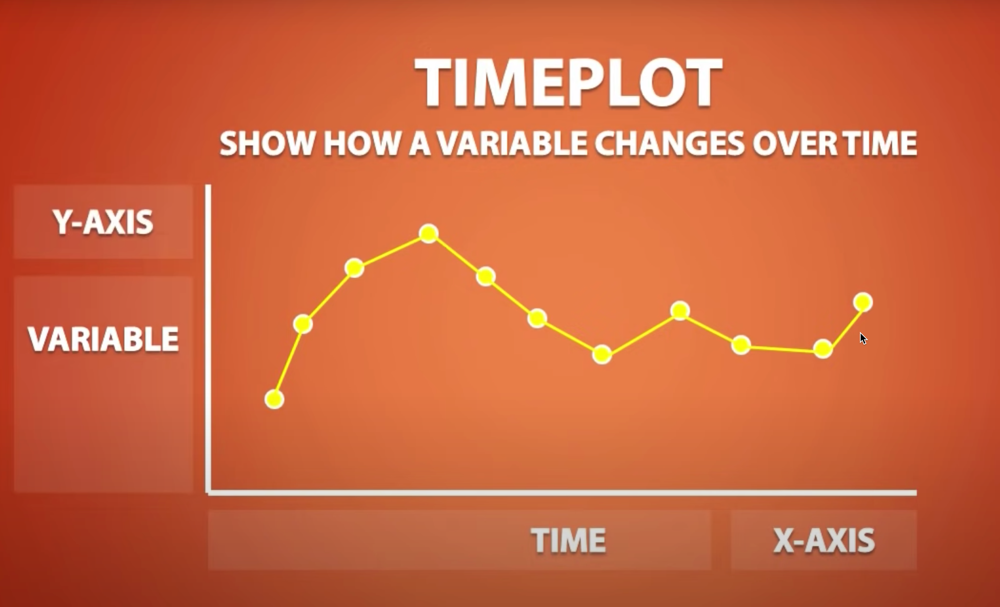
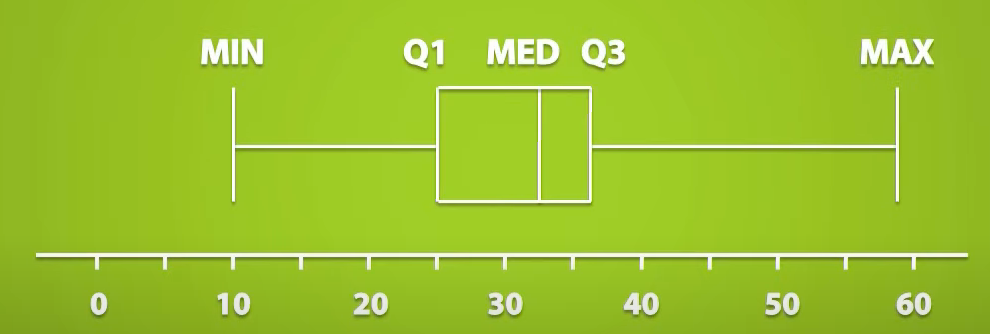
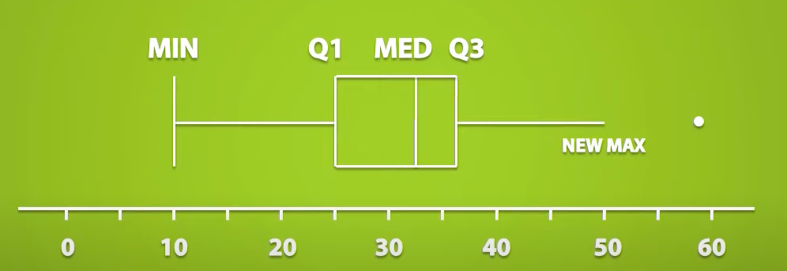
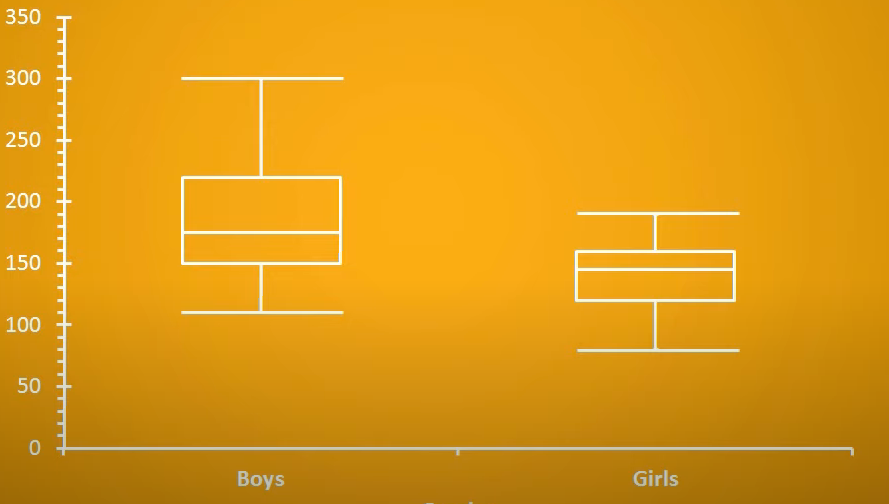
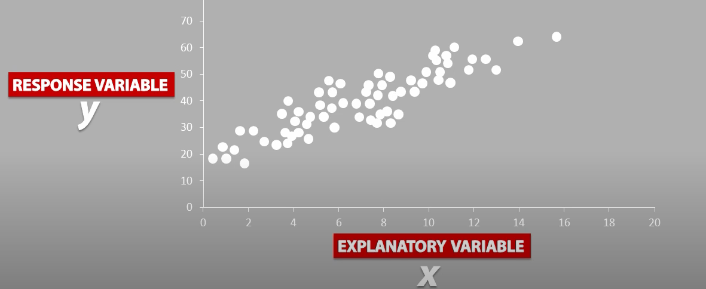

# Charts and Plots

Charts and Plots are used as tools to display data.

* Histogram (quantitative)
* Bar Chart (categorical)
* Pie Chart (categorical)
* Stemplots (quantitative)
* Timeplots (quantitative, at least 2 variables)
* Boxplot (quantitative)
* Scatterplot (quantitative, at least 2 variables)

## Histogram

* used to show distribution of the data we collected
* predetermined interval on the `x` axis
* frequency of interval in `y` axis

### Frequency Distribution

* histogram is form of a Frequency Distribution
  * it can be written in a table format

  |Weight   | Frequency|
  |------   |----------|
  |100-110  |8         |
  |110 - 120|16        |
  |120 - 130|12        |
  |130 - 140|8        |
  |140 - 120|6        |

  * here each interval does not include the right endpoint by convention
    * for example `110` is not included in the first interval
    * then why not write it as `100 - 119`?
      * this is because the value could be continuous and values after 119 and before 120 will be lost

### Relative Frequency Distribution

* same as Frequency distribution but shows `relative frequency` rather than frequency

  |Weight   | Relative Frequency|
  |------   |----------|
  |100-110  |0.16      |
  |110 - 120|0.32      |
  |120 - 130|0.24      |
  |130 - 140|0.16      |
  |140 - 120|0.12      |

* proportion of value in each interval in relation to the whole
* sum of relative frequency should be 1
* calculation
  $$
  Relative \space Frequency = \frac{Frequency}{{Total \space Frequency}}
  $$

* multiply by 100 to get percentage

  $$
  Relative \space Frequency \space in \space percent = \frac{Frequency}{{Total \space Frequency}} \times 100
  $$

* `histogram` can be plotted using relative frequency too

## Stemplots

* like histogram but show each data point
* consist of `stems` and `leaves`
* stem
  * refers to all but last digit
* leaf
  * refers to the very last digit
* stems and leaves are usually separated by a line
  * example `117` is written as `11 | 7`
* `3 | 0 1 2 5 5` means `30`, `31`, `32`, `35` and `35`

* when we have too many leaves, we can convert it to split stemplot

* when we have too many stem then we can change it like this

* another variation of stemplot is called `Back-to-Back Stemplot`
  * used to compare two set of data using same stems

  

## Timeplot

* shows how a variable changes over time

## Boxplot

Boxplot provides visual representation for `five number summary`.

* each vertical line represents number from `five number summary` from minimum to maximum

* left whisker is minimum
* right whisker is maximum
* box is interquartile range (IQR)
  * represents middle 50% of the data
  * equals to 3rd quartile - 1st quartile

### Modified Boxplot
  
* can be used to show outliers with a dot

### Side by Side Boxplot

* used to compare two or more datasets side by side

## Scatterplot

* show relationship between two variables
* explanatory variable on `x` axis
* response variable on `y` axis

* we could also have scatterplot comparing two unrelated data
  * so explanatory or response variable in this case
  * example - comparing hits in cricket and baseball