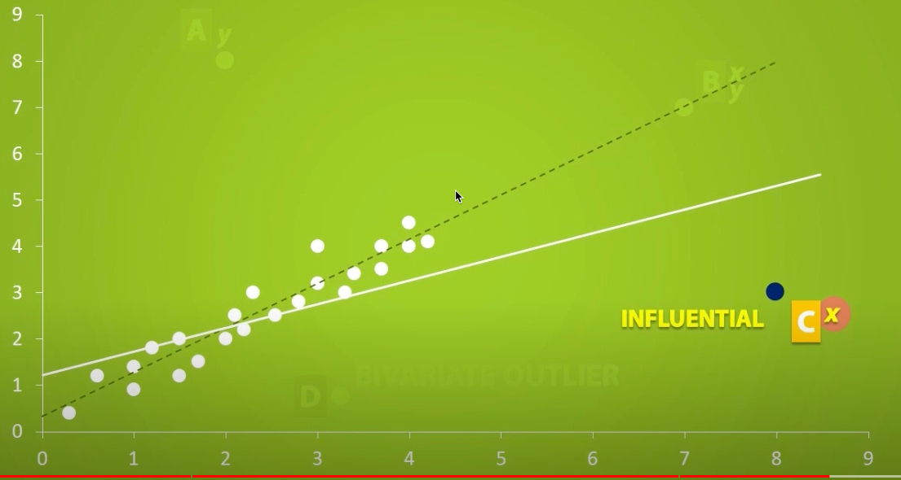

# Outlier

A data value that is numerically distant from a dataset

* falls outside the main pattern of data points
* could be too large or too small
* very atypical or surprising

* effects of outlier in measures of center and spread
  * mean - affected
  * median - affected to some extend
  * mode - mostly not affected
  * range - affected to large extend
  * standard deviation - affected

* Mathematics definition of outlier

$$
Value < Q1 - 1.5(IQR)\\
OR\\
Value > Q3 + 1.5(IQR)
$$

* could be outside the range in

  * x direction
    * will have significant impact in regression line
    * also known as `influential` outlier
    
  * y direction
    * not much impact in the regression line
    
  * both x and y direction
    * not much impact on regression line as the value is expected to be close to regression line
    

* data that is not outlier but doesn't fit the pattern is `bivariate outlier`
