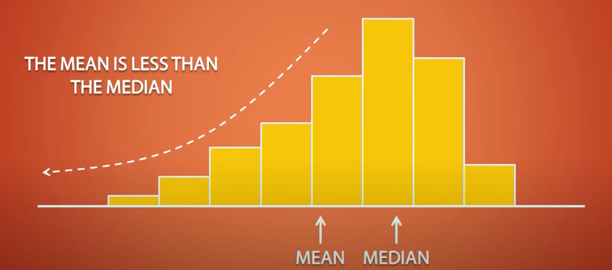
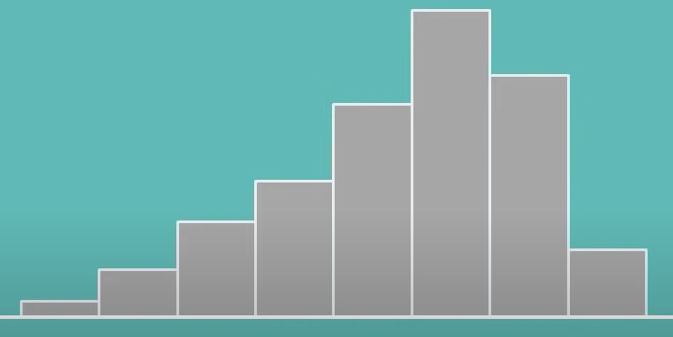
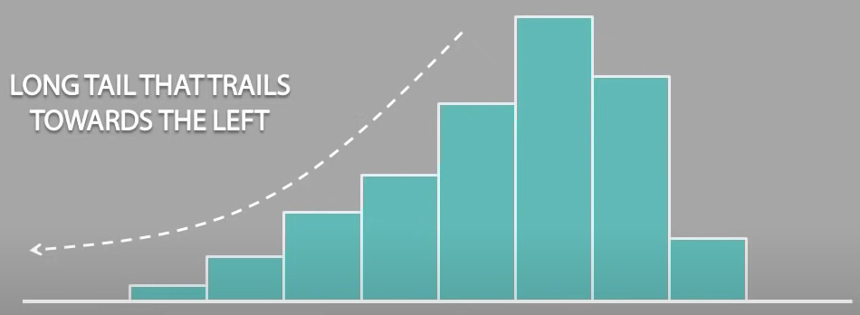
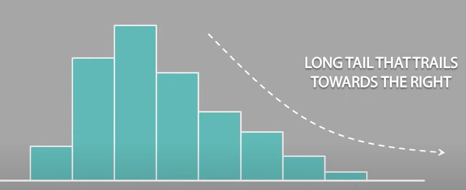
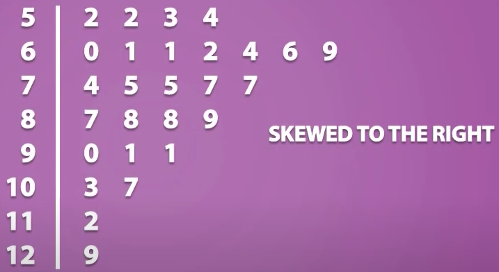
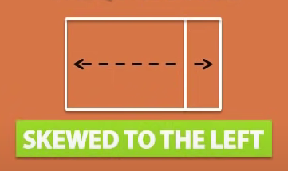
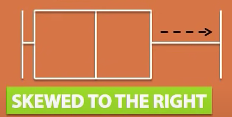
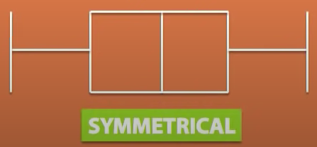

# Distribution

Distribution shows possible values for a variable and how often they occur.

## Symmetry and Skewness

### Symmetrical

* if it can be divided into two equal sizes of same shape

* point of symmetric will be at `median`
* `median` and `mean` will be same
  * `median = mean`

### Skewed

* if it cannot be divided into two equal sizes of same shape

* `mean` will be closer to the side of the skewness
* `median` will be closer to the opposite side of the skewness

* skewed to the left
  * if it has long tail that trails towards the left

* skewed to the right
  * if it has long tail that trails towards the right

#### Boxplot

* if we have unequal boxes
  * the side of the large box indicates the side of the skewness

* if the boxes are equal in size then use whiskers
  * the longer side of the whisker indicates the side of the skewness

* all equal (symmetrical)

