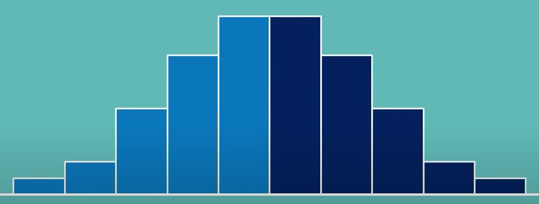

# Distribution

Distribution shows possible values for a variable and how often they occur.

## Symmetry and Skewness

### Symmetrical

* if it can be divided into two equal sizes of same shape

### Skewed