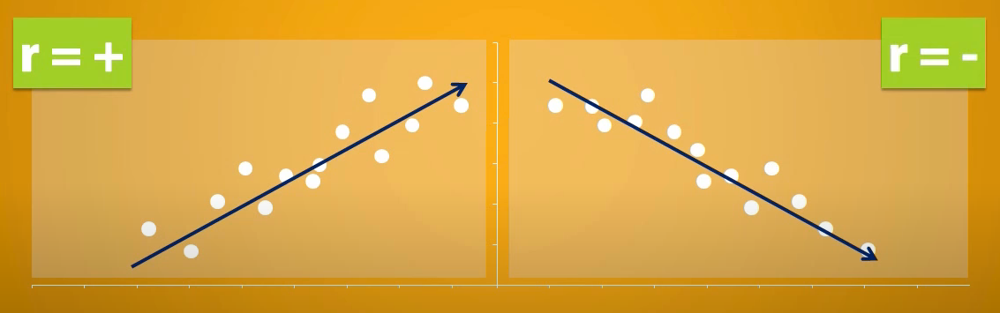

# Correlation (r)

* denoted as `r`
* shows the direction and strength of a `linear relationship` shared between two quantitative variables
* variables can be
  * explanatory and response
  * or unrelated
* can be expressed using scatter plot

## Direction

* correlation show the direction or slope of set of data
* positive `+r` indicates upward slope
  * `r = 1` when data points form perfect upward slope line
    * referred to as `perfect positive correlation`
    * has perfect linear relationship
* negative `-r` indicates downward slope
  * `r = -1` when data points form perfect downward slope line
    * referred to as `perfect negative correlation`
    * has perfect linear relationship

## Strength