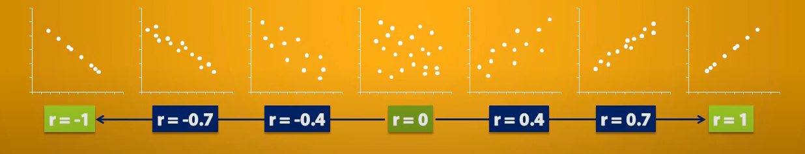
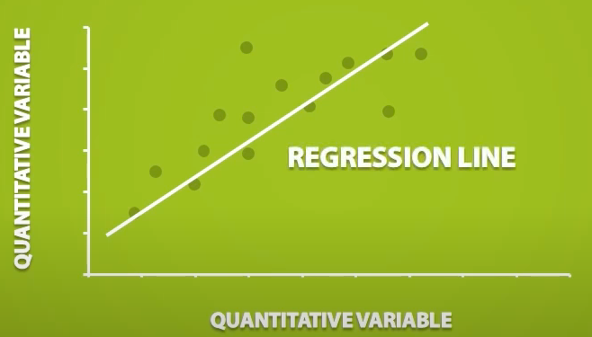

# Correlation and Regression

## Correlation (r)

* denoted as `r`
* shows the direction and strength of a `linear relationship` shared between two quantitative variables
* variables can be
  * explanatory and response
  * or unrelated
* can be expressed using scatter plot

### Direction

* correlation show the direction or slope of set of data
* positive `+r` indicates upward slope
  * `r = 1` when data points form perfect upward slope line
    * referred to as `perfect positive correlation`
    * has perfect linear relationship
* negative `-r` indicates downward slope
  * `r = -1` when data points form perfect downward slope line
    * referred to as `perfect negative correlation`
    * has perfect linear relationship

### Strength

* when `r = 0` there the relationship strength is 0
  * meaning there is no correlation between data 
* when value of `r` moves closer to `-1` or `+1` the strength of the relationship increases

### Calculation

$$
r = \frac{1}{(n-1)s_xs_y} \sum{(x_i - \bar{x})(y_i - \bar{y})}
$$

where:

$\bar{x}$ is mean of `x` axis values

$\bar{y}$ is mean of `y` axis values

`n` is number of data points

$s_x$ standard deviation of `x`

$s_y$ standard deviation of `y`

### R-Squared (r2)

* r x r
* has value only between 0 and 1
* indicates how close each data point fits to the regression line
  * in other words, it tells how well regression line predicts actual values

## Regression

* describe the relationship between variables by fitting a line to the observed data
  * i.e. making an actual line on the scatter plot
  * the line is called regression line
* predicts change in `y` when `x` increases by 1 unit
  * `y` can increase or decrease depending on the type of correlation

### Expression

$$
\hat{y} = b_0 + b_1x
$$

where

$\hat{y}$ is predicted value of y

$b_0$ is y intercept (the value at which the line touches y axis)

$b_1$ is slope of the line

$$
b_0 = \bar{y} - b_1\bar{x}
$$

$$
b_1 = r\frac{s_y}{s_x}
$$

* line calculated with this expressions is called `the line of least squares regression`