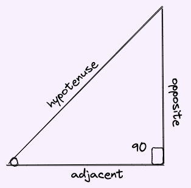

# Trigonometry

* means measuring triangles.

* part of a trigonometry that is of most interest is - trig functions in the context of circles

## Trigonometric functions

Normally these functions defines the ratio between the sides of a right triangle.

We cannot use it if the triangle is not right angled.

In other words, 
* $\theta$ must be $0 \le \theta \le 90$
* or acute triangle (not obtuse, reflex or boundary angles)

Here are the functions and their definitions:

$$sin(\theta) = \frac{opposite}{hypotenuse}$$

$$cos(\theta) = \frac{adjacent}{hypotenuse}$$

$$tan(\theta) = \frac{opposite}{adjacent}$$

the mnemonic is `SOH CAH TOA`

and their reciprocal functions are:

$$cosec(\theta) = \frac{hypotenuse}{opposite}$$

$$sec(\theta) = \frac{hypotenuse}{adjacent}$$

$$cot(\theta) = \frac{adjacent}{opposite}$$

## Trigonometric functions in a unit circle

* the unit circle is a circle with radius 1
* so in the triangle hypotenuse is the radius
* with unit circle
    - `x` is $cos(\theta)$ => $cos(\theta) = \frac{adj (x)}{hyp (1)}$

