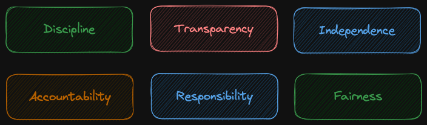

# Architecture Governance

* a system of controls over the architecture

  * process

  * people

* a system to ensure compliance of implementation with architecture

* reason is accountability

  * keeps everyone accountable for the architecture and the values it promises to deliver

* governance is layered (top board of directors to stakeholders from implementing teams, business, etc..)

  * corporate governance (board of directors, executive teams)

  * technology governance (CTO and similar)

  * IT governance (systems implementers)

  * architecture governance

* principles of good governance

  

  * Discipline

    * following what was agreed

    * not going against what was decided as a group

  * Transparency

    * who is making request and what was the decision are public

    * there is no scenario where request is approved based on who is requesting it

  * Independence

    * minimise conflict of interest

    * for example if Technology team is solely running the governance then the decisions may be favouring technology team

  * Accountability

    * people who are authorised to make decision are also accountable

      * when the decision turned out to be bad one

        * as decisions are transparent and independent

        * we can say this is why the decision was taken and we are happy to be accountable for that

  * Responsibility

    * people involved are required to act responsibly to the org and the stakeholders

  * Fairness

    * no unfair advantage to anyone

## Architecture Board

* TOGAF recommends architecture governance strategy is one of the key to success

* board is the group of people that oversee the implementation of that strategy

  * board is representative of all the key stakeholders in the architecture

  * establish targets, (SBBs, ABBs)

  * enforcement of arch compliance

  * keep up arch capability

  * ensure/oversee key metrics tracked are met

  * once started, the board is ongoing

## Architecture Contracts

* joint agreement between development partners and sponsors on

  * the deliverables

  * quality

  * and fitness-for-purpose of an architecture

* formal agreement that the teams involved will follow agreed target architecture

* contracts usually contain

  * continuous monitoring for compliance

  * adherence to principles, standards and requirements

  * identification of risks

  * accountability, responsibility and discipline

  * a formal understanding of the governance organisation

## Architecture Compliance

