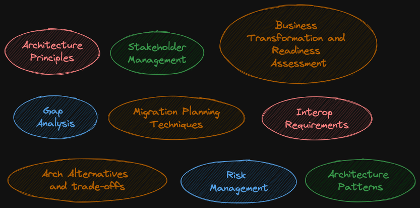
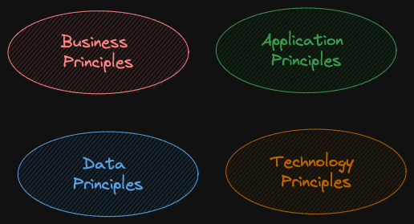
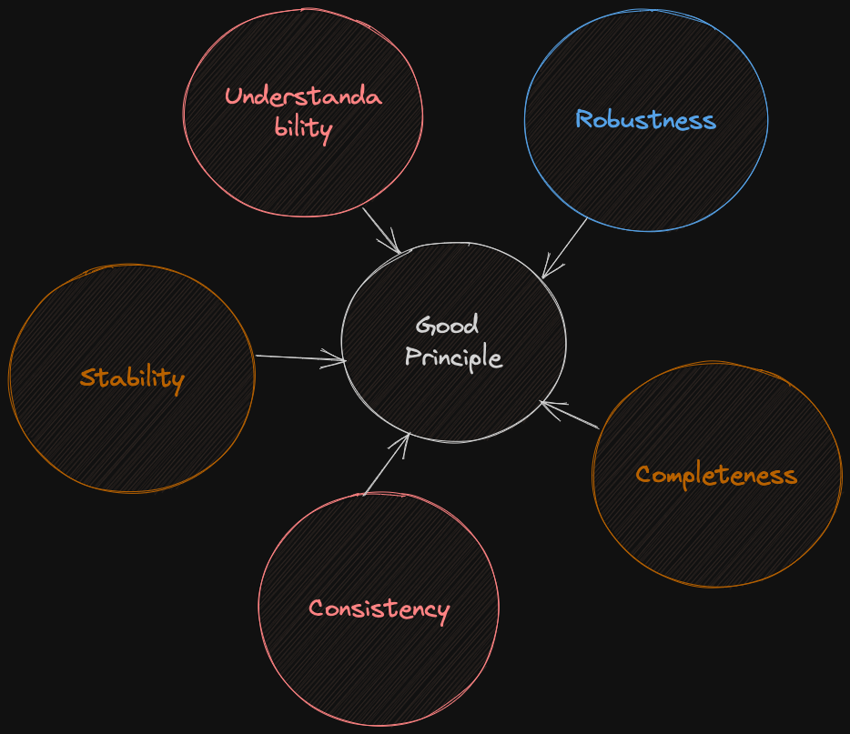
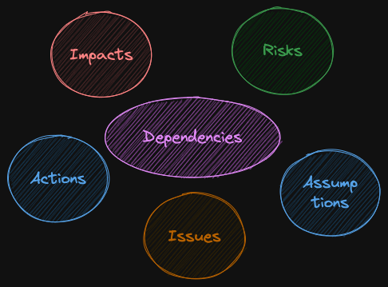

# ADM Guidelines and Tools

There are 9 key techniques to apply ADM

## 1. Architecture Principles

* Enduring set of general rules and guidelines about the architecture

  * Enduring because these hardly changes

    * Defined in preliminary phase

    * Broken down into

        

  * Examples

    * using off the shelf software rather than custom build

    * designated trustee for all shared databases who ensures quality

  * Five elements of good principle

       

    * Understandability

      * Easier to understand what the principle is talking about and easy to understand if you are violating the principle

      * No vague, gray area

    * Robustness

      * Definitive and precise even in complicated or controversial situations

    * Completeness

      * should cover every potential situations

    * Consistency

      * some times principles might be slightly conflicting and having some sort of priority for them help making consistent decisions

        * for example, there are two principles - using third party software and keeping data secure.

        * if no third party software can be found that securely stores data then if the priority is to have secure data, we can go for custom software

    * Stability

      * stable and hardly changes

## 2. Stakeholder Management

* Stakeholder is an individual, team, org, or class thereof, having an interest in an a system

* As an architect, being able to win support for your plans is a skill

  * explain how your plans help them

  * know who are the powerful stakeholders

  * (good SH management skill) makes it easier for approvals and budgets

  * establish communication plans

    * how often to communicate

    * what level of details to include

  * Read the room, identify problems and conflicts early in order to avoid them

    

## 3. Architecture Patterns

* idea that has been useful in one practical context and will probably useful in others - M. Fowler

* for example, pattern for spinning up a call center

* Architecture Building Blocks (ABBs) and Solution Building Blocks (SBBs) are reusable blocks

* Architecture Patterns is:

  * when, why and how you use ABBs and SBBs

* Arch patterns DO NOT play a big role in the TOGAF standard

  * it is up to you to find existing patterns and use them and not reinvent the wheel

* after been through few ADM cycles, you may have number of building blocks

  * you may want to establish patters for those building blocks so it may help in next ADM cycle

## 4. Gap Analysis

* used throughout ADM cycle

* key step in the BDAT phases and Migration Planning (Phases B-E)

* difference between baseline and target architecture

  * added

  * changed

  * intentionally omitted

  * accidentally omitted (lead to revising target architecture)

* should be easy to explain why something was added or removed

## 5. Migration Planning

* phases E & F are migration planning phases

* these phases contain number of tools to help migration planning

### Implementation factor catalog

* way to document factors that are going to impact migration plan

* implementation factor assessment & deduction matrix

* typically include

  

  

### Consolidated gaps, solutions & dependencies matrix

* gaps identified in phase B, C and D

* this matrix is a planning tool when creating work packages

* work packages identified during phase E and F

### Architecture definition increments table

* baseline to target architecture doesn't have to one step process, we can have transition architectures

* this table allow the architect to plan a series of transition architectures

* list the projects and then assigning their incremental deliverables across the transition architecture

* one of the artifact in phase E & F

### Transition architecture state evolution table

* show the proposed state of the architecture at various levels

* at a glance, anyone can see that what would be available after each transition state implementation

* can use colour coding matrix with Green, Yellow and Red, showing state of various services after each transition architecture is implemented

### Business value assessment technique

* technique to assess business value based on risk vs. value

* "at-a-glance" way to see the status of overall implementation project on the overall architecture implementation value

* some low value projects might be at risk, which is better than high value projects being at risk

  

## 6. Interoperability Techniques

* ability to share information and services

* each arch phase has definition of interoperability

* business interoperability

  * how business teams work together

  * helps to determine whether teams can work together or they are complete silos

* information interoperability

  * how data is shared (for example database access)

* technical interoperability

  * how technical services connect to one another

## 7. Business Transformation Readiness Assessment (BTRA)

* evaluating and quantifying and organisation's readiness to undergo change

* no point in creating architecture if it will be ignored

* understanding how to get your org to accept change is a key to success

* Recommended Activities

  * (Factors) determine readiness factors that will impact the organisation

    * Vision

    * Desire, Willingness, Resolve

    * Need

    * Business Case

    * Funding

    * Leadership, Sponsor, Champion

    * Governance

    * Accountability

    * IT Capacity to Execute

    * Enterprise capacity to Execute

  * (Present) present readiness factors using maturity models

  * (Assess rating) assess readiness factors, including determination of readiness factor ratings

  * (Assess risk & mitigation action) assess the risks for each readiness factor and identify improvement actions to mitigate the risk

  * (Address) work these actions into Phase E & F implementation and migration plan

## 8. Risk Management

* what are the risks of migrating to target arch

* there will always be some risk

  * identify

  * track

  * mitigate

* types of risks

  * initial level

    * before mitigation

  * residual level

    * leftover risk after mitigation

    * not able to mitigate or not willing to mitigate

* what is the cost to the business if it becomes true

## 9. Architecture alternatives and trade-offs [New in 10]

* identify alternative target architectures and perform trade-off between the alternatives

  * probably more than one way to do things

  * list all of them with trade-offs of each

    * flexibility

    * time and cost

    * time to achieve benefits

    * adherence to architecture guidelines

    * solution delivery method (develop, buy, etc...)

    * impact on business capability (i.e. can we do business as normal or not)

    * risk
